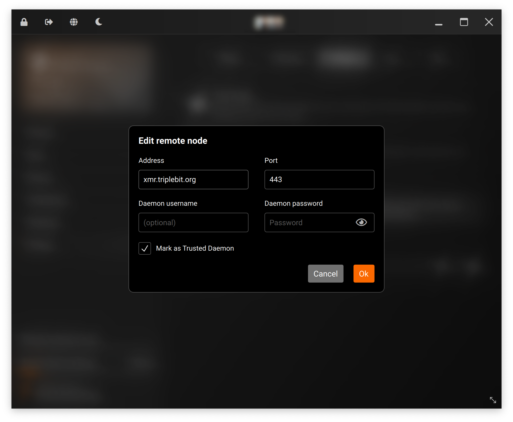

# Monero Remote Node

Triplebit operates a public **Monero remote node** accessible via both the clearnet internet and the Tor network:

- **`un4yrhwq4d53caoiaadeiur5e5wgkgp74zw3p3twqh3nxh6ztz347dad.onion:18081`**
- **`https://xmr.triplebit.org:443`** (with TLS/SSL)
- **`xmr.triplebit.org:18081`**
    - `[2602:f81c:8::111]:18081`
    - `23.188.56.111:18081`

You can connect to our node via your wallet by simply entering our domain (`xmr.tiplebit.org`) and port (`443` for TLS/SSL, `18081` otherwise) in your wallet's settings. An example of how to do this with the desktop GUI wallet [is provided here](https://www.getmonero.org/resources/user-guides/remote_node_gui.html).

You *should* connect with TLS over port `443` or connect using the `.onion` address via the Tor network, as both of these options provide additional security/encryption between yourself and our node.

{ loading=lazy }

Our node supports CORS (wildcard `Access-Control-Allow-Origin` header), meaning it can be used with web/javascript/wasm-based wallets. We will support I2P by the end of 2024.

## Privacy Advice

Using a public remote node saves you a lot of local computing resources, because you do not need to download the entire Monero blockchain (150+ GB).

However, using a public remote node is generally a privacy risk. The Monero node can see your IP address and when you perform a transaction (it **cannot** see how much you spend, where the Monero is going, or how much Monero you have in your wallet).

<mark>If you are concerned about your IP being revealed you should always connect via the Tor network.</mark> While Triplebit does not collect this information, you should not take our word for it (as a general rule to apply to any service provider in your life).

Triplebit currently operates its node at the lowest possible [logging level](https://getmonero.dev/interacting/monerod.html#logging), and it is subject to our [transparency reports](transparency.md) published on this website. We log to ensure everything is operating smoothly and to diagnose issues, but when our node has been online without incident for a substantial amount of time we will disable logging completely.

## IPv6

Triplebit's goal is to enable IPv6 connectivity and promote IPv6 adoption across the Monero network and the internet as a whole. As such, our relays and infrastructure are 100% dual-stack.

Unfortunately, Monero disables IPv6 by default. We have it enabled for RPC and P2P connections, so you can connect to our remote node via IPv6 from your wallet without issue.

If you operate your own Monero *node*, either public or private, we strongly encourage you to enable the following configuration setting to increase IPv6 adoption on the Monero network:

```
p2p-use-ipv6=1
```

You can also optionally ensure you peer with our node via IPv6 by adding these settings to your configuration (note port 18080 is used for P2P connections, as opposed to 18081 for RPC):

```
add-peer=[2602:f81c:8::111]:18080
add-priority-node=[2602:f81c:8::111]:18080
```

## About Monero

The vast majority of cryptocurrencies operate with a transparent blockchain, making them useless for those seeking privacy.

**Monero** is the most popular cryptocurrency which protects your privacy by default. Every Monero transaction hides the transaction amount, sending and receiving addresses, and source of funds without any hoops to jump through, making it an ideal choice for cryptocurrency novices looking to pay for things privately online.

You can [read more about Monero at privacyguides.org](https://www.privacyguides.org/en/cryptocurrency/) if you'd like to learn more.

## Hardware/Network Specs

Triplebit's Monero node runs on a highly-available 5-node Proxmox cluster, with automatic failover to ensure it is a reliable service for those using it with their wallets.

We operate out of Ridgeview datacenter in Minnetonka, Minnesota on a 10 Gbps connection to the internet and a 10 Gbps connection to the Midwest Internet Cooperative Exchange.

## Configuration

Our `monero.conf` file for reference:

```
data-dir=/srv/monero

log-file=/var/log/monero/monero.log
log-level=0
max-log-file-size=2147483648
check-updates=notify

public-node=1
db-sync-mode=fastest:async
rpc-ssl=autodetect

p2p-bind-ip=0.0.0.0
p2p-bind-port=18080
p2p-use-ipv6=1
p2p-bind-ipv6-address=::
p2p-bind-port-ipv6=18080

add-peer=[2a0b:f4c2:2::63]:18080
add-peer=[2a0b:f4c2:2:1::223]:18080
add-peer=23.137.57.100:18080

add-priority-node=[2a0b:f4c2:2::63]:18080
add-priority-node=[2a0b:f4c2:2:1::223]:18080
add-priority-node=23.137.57.100:18080

rpc-bind-port=18088
rpc-bind-ipv6-address=::
confirm-external-bind=1

rpc-restricted-bind-ip=0.0.0.0
rpc-restricted-bind-port=18081
rpc-use-ipv6=1
rpc-restricted-bind-ipv6-address=::
rpc-access-control-origins=*
disable-rpc-ban=1

no-igd=1
no-zmq=1

limit-rate-up=256000
limit-rate-down=256000
out-peers=64

tx-proxy=tor,127.0.0.1:9050,32
anonymous-inbound=un4yrhwq4d53caoiaadeiur5e5wgkgp74zw3p3twqh3nxh6ztz347dad.onion:18083,127.0.0.1:18083,128

start-mining=45i7M1FfXuBHLMdWm4ZTvFM5tGTSeibjEBpFSBCs2qbSRrHkUpKN5DRVK7T65hbg3WhGXepH7y6Xvb8XdxBmBS8V4AJXtyC
mining-threads=1
```

We have enabled mining to improve decentralization of the Monero network; mining is key to enabling Monero's privacy-preserving transaction obfuscation features. However, we do not devote substantial resources to mining Monero, only a single CPU at this time.
